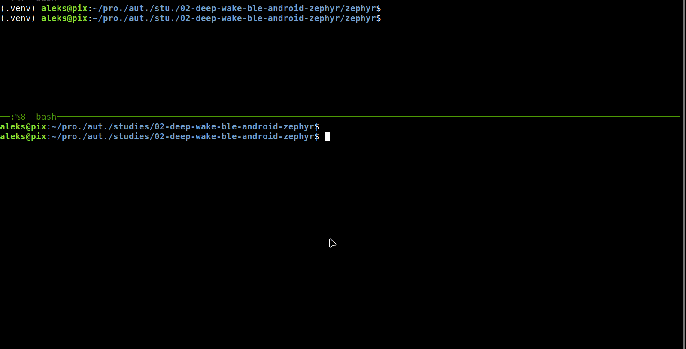
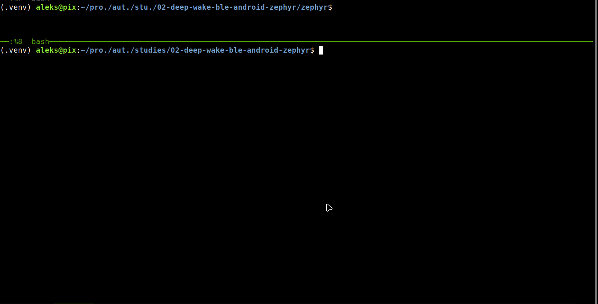
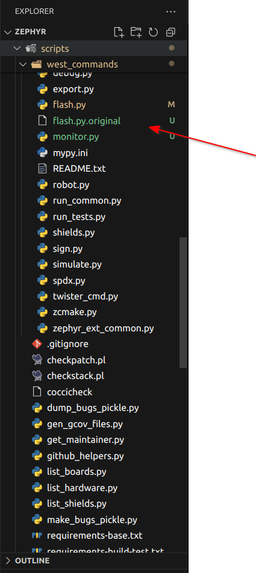

# West Flash Serial Monitor Automation


## Problem
When using `west flash` to flash firmware onto a device, if the serial port is occupied (e.g., by a serial monitor), the flashing process cannot proceed. This requires the user to manually disconnect the serial monitor, return to the terminal, and re-execute the `west flash` command. 

After flashing, you'll need to restart the serial monitor to see the device's output again. This can be frustrating if there's an error during the device's startup, as the initial boot messages might be missed, making debugging harder. On some devices, pressing the boot button to retry can even disconnect the serial port, adding more challenges to the process.




## Solution

After installing the package, a new command `west monitor` command becomes available. This command integrates seamlessly with the `west flash` process. When `west flash` is executed, `west monitor` automatically 'detects' the flashing process, disconnects the serial port to allow flashing, and then reconnects the serial monitor once flashing is complete.

This ensures that:
- The serial port is freed for flashing without manual intervention.
- The serial monitor resumes automatically after flashing, allowing you to see the device's output immediately.
- Initial boot messages are captured, aiding in debugging.

Simply use `west monitor` to start the serial monitor, and it will handle the rest whenever you flash firmware using `west flash`.




> **Note:** To exit the `west monitor`, press `Ctrl + A` followed by `Ctrl + X`.


## Installation
1. Install the package directly using `pip`:
   ```bash
   pip install git+https://github.com/aleksmarcelo/west-flash-serial-monitor.git
   ```


## Files Modified

The following files in the `zephyrproject/zephyr/scripts/west_commands` directory will be modified as part of the installation process:

1. `flash.py` - This file will be updated to integrate with the `west monitor` functionality.
2. `west-commands.yml` - This file will be updated to include the new `west monitor` command.

Additionally, the following new files will be added:
1. `monitor.py` - Implements the `west monitor` command.
2. Backup files for the original `flash.py` and `west-commands.yml` will be created as `flash.py.original` and `west-commands.yml.original`.

These changes ensure seamless integration of the `west monitor` command with the existing `west flash` process.




## Uninstallation
1. Uninstall the package using `pip`:
   ```bash
   pip uninstall west-flash-serial-monitor
   ```

If you want to restore the original `west` commands and remove all modified files, execute the following commands:

```bash
cd ~/zephyrproject/zephyr

# Restore the original flash.py file
git restore scripts/west_commands/flash.py
git restore scripts/west-commands.yml

# Remove the modified files
rm scripts/west_commands/monitor.py
rm scripts/west_commands/flash.py.original
rm scripts/west-commands.yml.original
```
